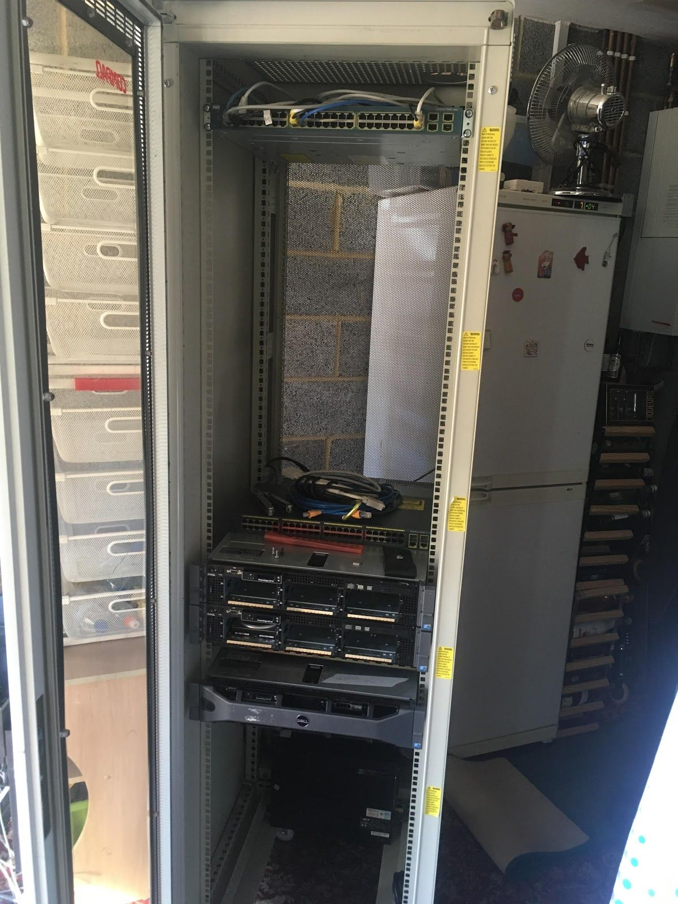
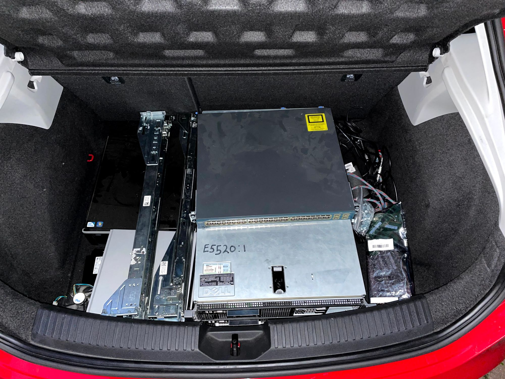
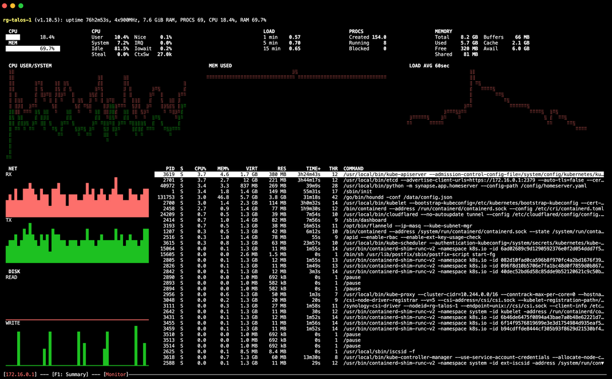

It's like the original [Home lab](../kubernetes-at-home) but this time, not quite as bad.

Home labs are very personal: what works for me won't work for you. What you like, I may dislike. Homelab V2.

The whole idea behind Homelab V2 came about because one of the services I host, Mealie, crashed so badly that we had to revert to cookbooks and digging through backup JSON to find recipes.

The new lab is designed to score high on the SOAP scale (significant other acceptance parameters) — meaning my partner finds it simple to consume services and treats it like a SaaS product.

It's designed to be immutable, git-native, cheap to run, and requires minimal maintenance.

## Brief overview of the homelabs I've had

It started in my parents’ house where I used to have a 48U rack:

I then migrated most of my setup to SaaS offerings because I had to sell the servers — a sad day. Luckily, they went to an old friend of mine from school who would put them to good use:

All my servers, switches, and routers in the back of my old car on their way to Jack.

I moved around a lot between leaving my parents’ house and getting my own apartment, which meant I couldn't have anything permanent set up.

Finally, when I landed in Berkshire, I had the means to set up something *somewhat* reliable. I present, k3s at home:

This cluster was great; it only really [had one outage](https://documentation.breadnet.co.uk/outage/2023-11-26-04/), and for the most part, was pretty decent.

[//]: # (TODO: Link to Kubernetes at home blog post)

However, there were massive reliability issues when I moved to my new address. The IP addresses changed for some reason, and the certificates also expired. It was time to do something about it.

# Homelab V2

Homelab V2 is, for all intents and purposes, RAID but with computers.

The lab is built from a stack of Dell 3040 SFF PCs with 8GB RAM each and 128GB SSDs.

Currently, there are 6 of these, with 5 running and one as a spare.

| Use        | Count |
|------------|-------|
| Kubernetes | 4     |
| Database   | 1     |

As you can deduce from the setup, I am still running Kubernetes. But this is where it changes. I am now running Talos, a full OS rendition of Kubernetes designed to be lightweight, all configured from a single file. You can get cool tools like `talhelper` that help template out config and generate node configs.

Unlike K3s, which is installed on Ubuntu as a binary, Talos *is* the operating system and Kubernetes itself.

I won’t go too deep into Kubernetes setup here, as I plan to write another blog post about this with more details.

> Todo: Write blog post on Talos cluster!

I’ve got 3 nodes in this cluster. You’re probably thinking: "There are 4 nodes in the table above, but only 3 here?" And you’re right.

The 4th node is a single-node cluster called `utils` that runs some *utility* apps (discussed later). The last node is just an Ubuntu host running `mariadb` for now, though some apps require Postgres, so that will be added later.

## What apps are you running

Currently, I am running:

- Mealie
- Gatus
- Matrix server (blog post soon)
- Pocket-id (handles all my OIDC auth)
- Hound ([Git repo search](https://github.com/hound-search/hound))
- Atlantis (Terraform PR automation)
- Postfix Mail forwarder (allows internal apps to send mail without per-application auth; authenticated in one place)

## Planned apps

- Jellyfin
- Linux ISO downloading software
- Pinchflat
- ErsatzTV
- Airtrail
- Kanboard.org or [Vikunja](https://vikunja.io)
- Karakeep ([Previously Hoarder](https://docs.karakeep.app))
- Paperless-ngx
- [IT Tools](https://github.com/CorentinTh/it-tools)
- changedetection.io
- Snipe-IT
- [Wallos](https://wallosapp.com)
- Wazuh
- Umami
- Matomo
- Terraform registry cache (via NGINX for Atlantis)
- Lube Logger ([for cars](https://lubelogger.com))
- [Donetick](https://donetick.com)
- [FreshRSS](https://freshrss.org/index.html)

## Storage

I picked up a Synology NAS on eBay for around £800 (a big hit with the partner), serving iSCSI LUNs to the Talos nodes.

## Closing notes

This is a great starting point for the lab. Everything is fresh and new, and I’m doing it right the first time. Keep an eye on the site for new posts.
